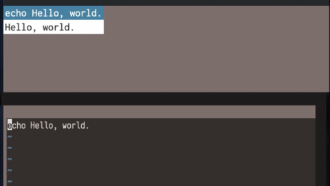
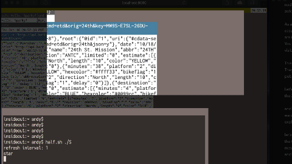

# half.sh

## [Screencast / Demo](https://www.half.sh)





## Why?

* The command line is amazing for fluidly exploring a data set or an automation
  task but an adhoc session can quickly spiral to the point it's no longer
  discernible or reusable. Is there a way you can keep that fluidity and
  instant feedback but introduce some structure to make things reusable? Also,
  to be able to return to an adhoc session and pick up where you left off?

* 'Use small tools' gets a lot of lip service, but systems are almost
  exclusively composed in monolithic ecosystems (for example, Golang, Python,
  Node). What would it look like to actually build a system using small tools?
  In my experiments it quickly gets unruly. Does it look better if we have a
  better way to compose shell scripts?

* Have you ever produced an interesting result in a shell session and
  thought, 'I just want this to run forever now' Is there a way to seamlessly
  take these adhoc sessions and then run them redundantly and robustly?

## run locally

The following static cli tools are required. A binary version for macOS have
been committed to this repo. For Linux, you currently need to install these
manually:

* realpath
* watchexec  - https://github.com/watchexec/watchexec
* websocketd - https://github.com/joewalnes/websocketd

```
$ git clone https://github.com/cablehead/half.sh
$ cd half.sh

# install yarn
$ brew install yarn  # (macOS)

# build the static web ui
$ cd www
$ yarn install
$ yarn build-dev
$ cd ..

# install jq
$ brew install jq  # (macOS)

$ bin/half.sh [session-path (default: ~/.half.sh)]
```

## commands

Usage is currently vi centric. Open an issue to discuss adding your favorite
mode of interaction! e.g. emacs.

Careful! This is currently a very sharp knife. There are no confirm prompts or
undo.

```
* '?': show available commands
* <enter>: edit currently selected node
* '|': pipe the current node to create a new dependent node
* 'h': select the node to the left
* 'l': select the node to the right
* 'k': select the node above
* 'j': select the node below
* 'i': insert a new root node
* '*': favorite the selected node so it shows in the top favorite bar
* 'd': delete the currently selected node and all of it's dependents
* 'c': clone the currently selected node and all of it's dependents
* 'r': prompts for a refresh interval, a number in seconds, for how regularly to refresh the currently selected node

* 'I' (capital): insert a new project (dashboard)
* ',': rename the current project
* 'H': (capital) select the project to the left
* 'L': (capital) select the project to the right
* 'D' (capital): delete the current project
```


### session structure

```
ROOT/
  flake
  stream
  P -> project/<id>
  project/
    <id>/
      name
      N -> node/<id>
      node/
        <id>/
          run
          stdin -> ../<id>/stdout
          stdout
          stderr
          status
          starred
          refresh
```

```
{"project": {
    "515366767042576": {
        "name": "squirrel",
        "node": {
